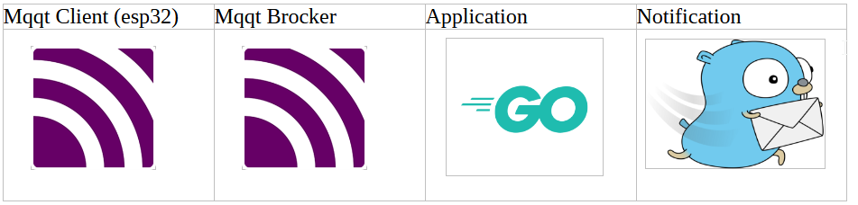

# Home-Security-Project
This projetc is not ready to deploiement

Projet de sécurisation de domicile
## Design

- Composants matériels:
  - esp32c3
  - pin64 ou
  - mangopi

- Composants logiciel sur pine64 ou mangopi
  - mqttclient
  - mqtt brocker
  - application GO
  - gotify 

##Principe

- l'esp32c3 publie dans le topic mqtt l'etat de la porte
  -- porte ferme
  -- porte ouverte
- Le programe GO analyse le retour du topip porte (si topic alarm_enclanchée=1
  -- porte ferme normal
  -- porte ouverte anormal alert vers gotify
  -- porte ouverte anormal déclenchemment sirene
  -- annulation de l'alarme par bouton sur esp32.
  -- annulation de l'alarme par publication sur gotify.

### Opération

## Build

